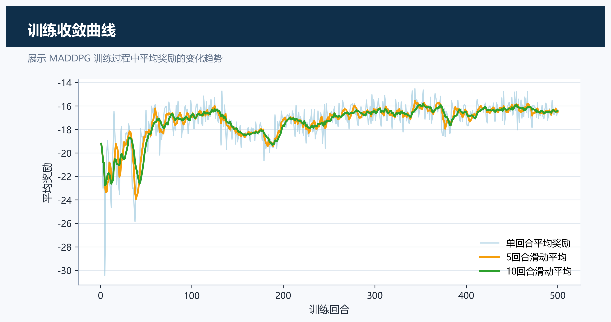
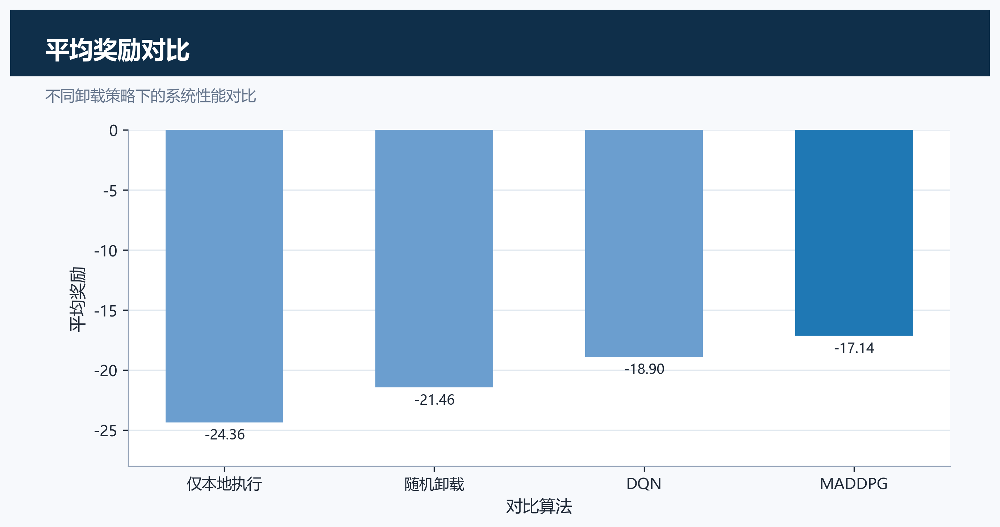
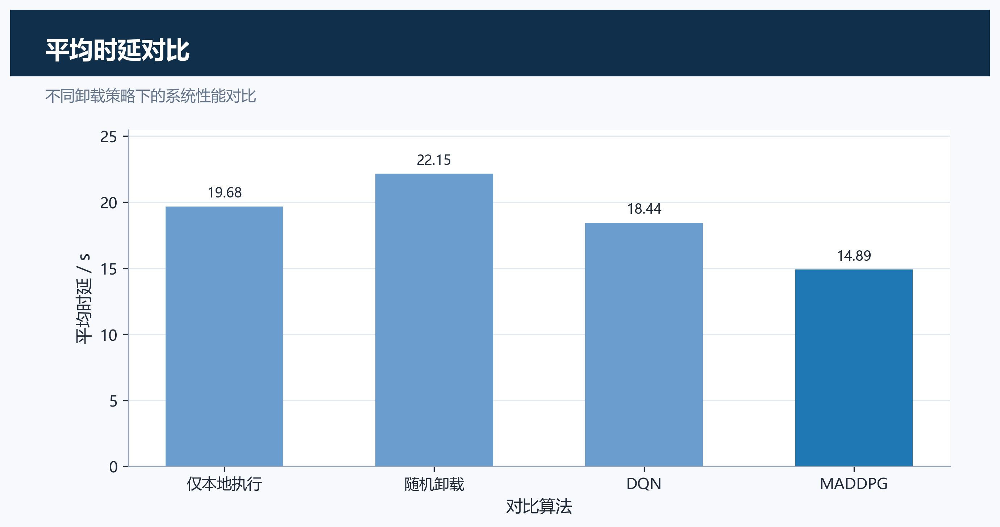
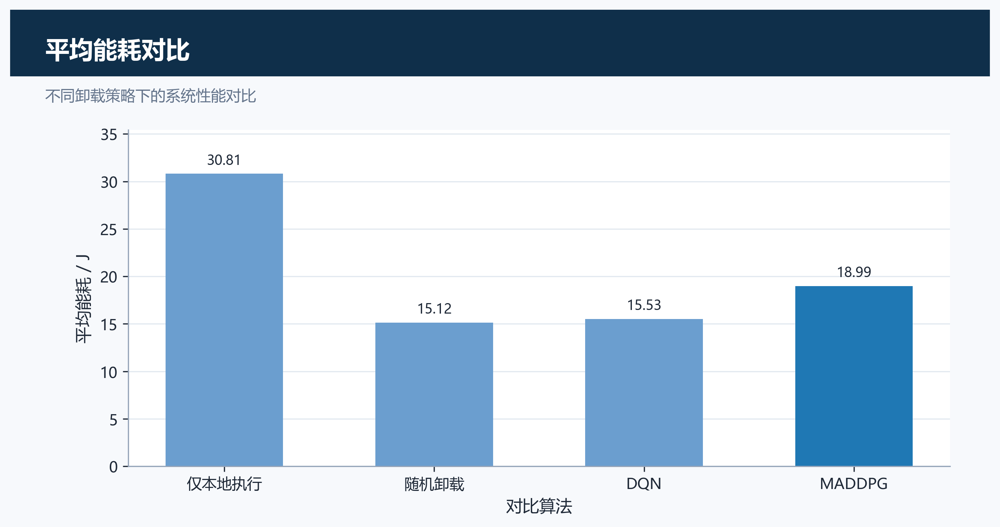
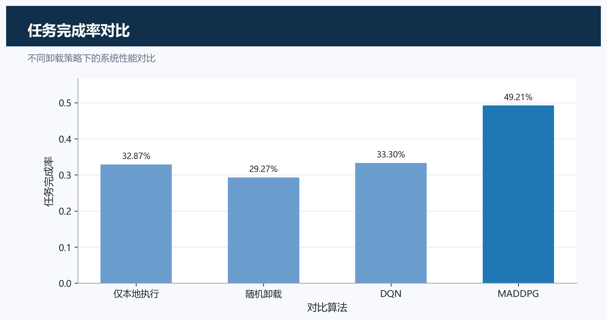
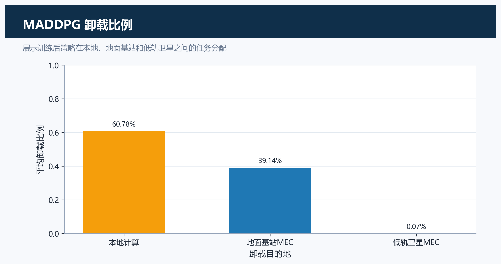
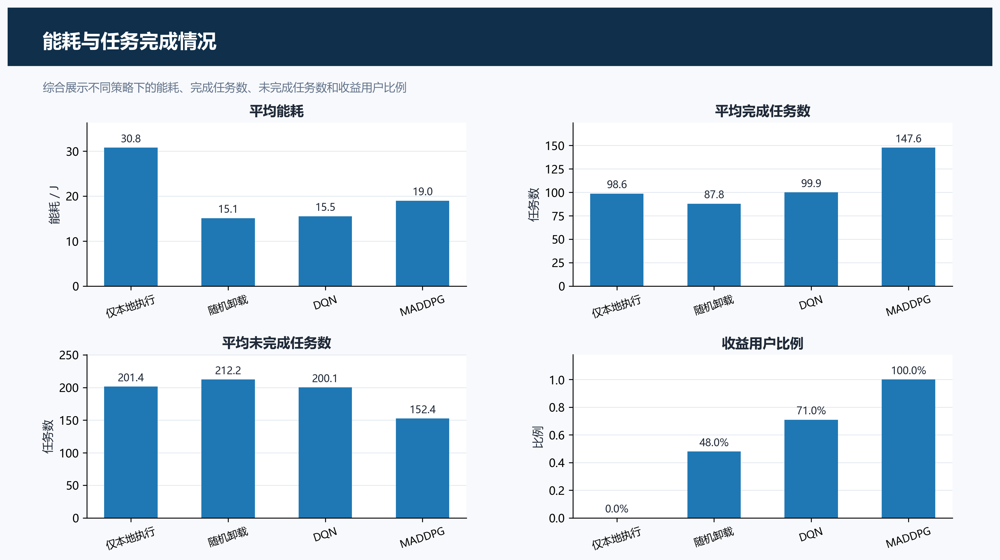
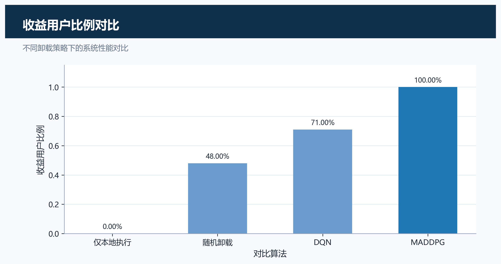
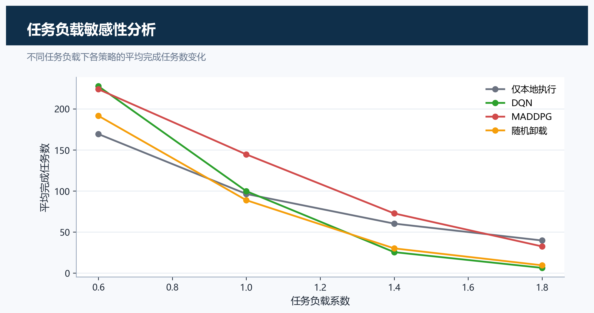

# Satellite-Terrestrial Task Offloading MADDPG

本项目面向星地融合移动边缘计算场景，研究多用户任务在本地计算、地面基站
MEC 和低轨卫星 MEC 之间的卸载决策。项目以 MADDPG 作为核心算法，并与 All
Local、Random、DQN 策略进行对比。

## 环境安装

```bash
uv sync
```

训练、评估默认使用 CUDA。没有 NVIDIA 显卡或 CUDA 环境不可用时，可以显式
追加 `--device cpu`。

## 快速运行

```bash
uv run python train_maddpg.py --episodes 3
uv run python train_dqn.py --episodes 3
uv run python evaluate.py --episodes 3
uv run python plot_results.py
```

## 正式实验

```bash
uv run python train_maddpg.py --episodes 500
uv run python train_dqn.py --episodes 500
uv run python evaluate.py --episodes 100 --sensitivity
uv run python plot_results.py
```

正式实验会生成模型权重、训练日志、评估表格和图像。`results/` 目录属于实验
输出目录，已在 `.gitignore` 中忽略，不会提交到仓库。

## 实验结论

500 轮训练后的正式评估结果如下。

| 算法 | 平均奖励 | 平均时延 | 平均能耗 | 成功率 | 平均完成任务数 | 收益用户比例 |
|---|---:|---:|---:|---:|---:|---:|
| All Local | -24.3609 | 19.6790 | 30.8101 | 32.87% | 98.62 | 0.00 |
| Random | -21.4558 | 22.1519 | 15.1161 | 29.27% | 87.80 | 0.48 |
| DQN | -18.8984 | 18.4366 | 15.5294 | 33.30% | 99.91 | 0.71 |
| MADDPG | -17.1377 | 14.8938 | 18.9877 | 49.21% | 147.64 | 1.00 |

结果表明，MADDPG 在平均奖励、平均时延、任务完成数量、任务成功率和收益用户
比例上优于 DQN。DQN 的平均能耗更低，因此论文表述应强调：MADDPG 通过更灵活
的连续卸载比例牺牲部分能耗，换取更好的时延和任务完成性能。

## 实验图表

> 下列图片由 `uv run python plot_results.py` 生成，路径位于 `results/figures/`。
> 该目录被 git 忽略，重新运行实验后会自动刷新。

### 训练奖励曲线



### 平均奖励对比



### 平均时延对比



### 平均能耗对比



### 任务成功率对比



### MADDPG 卸载比例



### 任务完成情况统计



### 收益用户比例对比



### 任务负载敏感性分析



## 输出文件

```text
results/models/maddpg_best.pt
results/models/dqn.pt
results/csv/maddpg_train_log.csv
results/csv/dqn_train_log.csv
results/csv/evaluation_summary.csv
results/csv/sensitivity_summary.csv
results/figures/reward_curve.png
results/figures/avg_reward_comparison.png
results/figures/avg_delay_comparison.png
results/figures/avg_energy_comparison.png
results/figures/success_rate_comparison.png
results/figures/offload_ratio_maddpg.png
results/figures/task_completion_summary.png
results/figures/benefit_user_ratio_comparison.png
results/figures/task_load_sensitivity.png
```

## 仿真模型

环境采用多用户、单地面基站 MEC、单低轨卫星 MEC 的简化星地融合网络模型。
每个用户观测任务大小、信道状态、到基站和卫星的距离、MEC 资源状态等信息，
并输出本地计算、基站卸载和卫星卸载的任务比例。

奖励函数采用团队成本形式，综合平均时延、平均能耗和任务截止时间违反率。低轨
卫星采用简化线性运动模型，链路速率随距离和路径损耗动态更新。当前模型不包含
多卫星路由、星间链路、真实星历数据、云中心或跨时隙队列。
